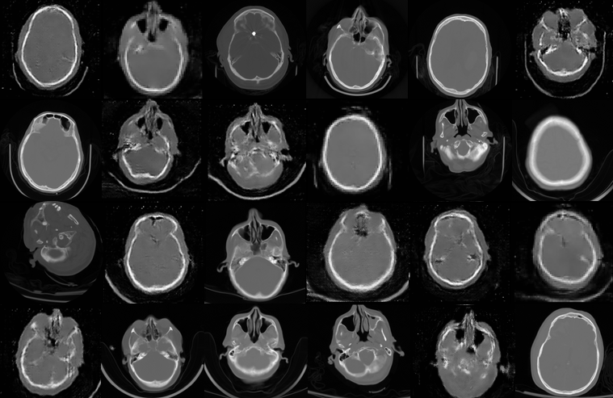

# Generative Adversarial Networks for Computed-Tomography scans

	

This project deals with Generative Adversarial Networks (GAN's). More specifically generating new Computed-Tomography (CT) scans (a specific medical image).  The above pictures shows 12 generated "fake scans" and 12 real scans. 

For more specific project description check out the *report* in the repo (titled as *Report.pdf*) 

